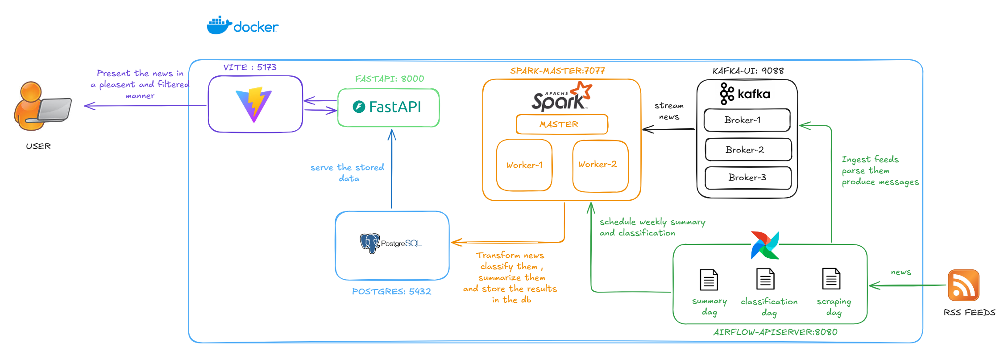

# 📰 Insight Africa

> **Stay informed without the noise.**

Like many, I often find the news overwhelming — a flood of headlines, conflicting reports, and doomscrolling fatigue. But staying informed shouldn't mean feeling drained. That’s why I created **Insight Africa**: a smart news platform that collects, classifies, summarizes, and visualizes news from diverse sources across Africa.

This project brings together **Data Engineering**, **Machine Learning**, and **Modern Web Development** to help users quickly grasp key narratives and trends — all presented in a clean and interactive UI.

---

## ⚙️ Overview

Insight Africa consists of **three core systems** working together:

### 🔄 1. ETL Pipeline

* **Runs every 3 hours**
* **Workflow:**

  * An **Airflow DAG** scrapes data from curated RSS feeds.
  * Parsed content is streamed into **Kafka**.
  * A **Spark Streaming Job** transforms and persists the data into **PostgreSQL**.

### 🤖 2. Machine Learning

* A **classification pipeline** labels each article by topic (e.g., *Politics*, *Health*, *Tech*).
* Weekly batch jobs:

  * Generate an **automated summary**
  * Perform **Topic Modeling** (LDA)
  * Build a **Knowledge Graph** from entity co-occurrences

### 🌐 3. API & Frontend

* **FastAPI backend** exposes REST endpoints for all processed data and analytics.
* **React + Vite frontend** displays:

  * Summaries, charts, and tags
  * An interactive knowledge graph
  * Filtering/search by topic, keyword, or date

---

## 🧱 Architecture



---

## 🛠️ Airflow DAGs

There are three orchestrated workflows defined in the `dags/` folder:

| DAG Name             | Schedule      | Purpose                                                         |
| -------------------- | ------------- | --------------------------------------------------------------- |
| `scraping_dag`       | Every 3 hours | Scrape RSS feeds and insert raw news into Kafka                 |
| `classification_dag` | Triggered     | Classify new entries using a large language model (Mistral API) |
| `weekly_summary_dag` | Weekly        | Generate summary, topic models, and knowledge graph             |

---

## 🗄️ Database Infrastructure

The system uses a **PostgreSQL** instance to persist all processed data. It contains four main tables:

* `news`: Stores each ingested article along with its metadata, tags, and classified category.
* `weekly_summaries`: Stores summaries and topic models generated weekly.
* `network_metrics`: Holds week-level global statistics of the knowledge graph.
* `node_metrics`: Contains detailed metrics for individual nodes/entities in the graph.

These tables are denormalized for simplicity and performance, allowing efficient querying and API access.

---

## 💪 Run Locally (Docker)

### 🔧 Requirements

Create a `.env` file at the root of the project with the following values:

```env
# Airflow
AIRFLOW_UID=50000
AIRFLOW_PROJ_DIR=.
_AIRFLOW_WWW_USER_USERNAME=admin
_AIRFLOW_WWW_USER_PASSWORD=admin
AIRFLOW_HOME=/opt/bitnami/airflow

# Kafka
KAFKA_BOOTSTRAP_SERVERS=kafka-broker-1:9092,kafka-broker-2:9092,kafka-broker-3:9092
KAFKA_NEWS_TOPIC=news_topic

# Spark & FastAPI
MISTRAL_API_KEY=your_mistral_key_here
SPARK_JOBS_PARENT_FOLDER=/opt/airflow

# Postgres
POSTGRES_SERVER=user-postgres
POSTGRES_USER=postgres
POSTGRES_PASSWORD=eded404
```

📀 Get your free [Mistral API key](https://auth.mistral.ai/ui/login)

### 🚀 Setup

```bash
# Initialize airflow
docker-compose up airflow-init

# Start the entire stack
docker-compose up -d
```

### 📰 Available Interfaces

| Service         | URL                                                      |
| --------------- | -------------------------------------------------------- |
| App Frontend    | [http://localhost:5173](http://localhost:5173)           |
| FastAPI Backend | [http://localhost:8000/docs](http://localhost:8000/docs) |
| Spark UI        | [http://localhost:9090](http://localhost:9090)           |
| Kafka UI        | [http://localhost:9088](http://localhost:9088)           |
| Airflow UI      | [http://localhost:8080](http://localhost:8080)           |

---

## 📊 API Endpoints

| Route                                               | Description                  |
| --------------------------------------------------- | ---------------------------- |
| `/get_news/`                                        | Return recent articles       |
| `/get_weekly_summary/`                              | AI-generated weekly overview |
| `/get_weekly_summary_visualization/topic_html`      | LDA topics (HTML format)     |
| `/get_weekly_summary_visualization/knowledge_graph` | Graph visualization data     |
| `/get_weekly_networks_metrics/`                     | Graph-level stats            |
| `/get_weekly_node_metrics/`                         | Node-level centrality data   |
| `/get_weekly_summary_insights/`                     | Text-based highlights        |
| `/compare_two_weeks/`                               | Trend comparison over time   |

---

## 🌐 Frontend Features

Built with **React + Vite** using **TailwindCSS** and **FontAwesome**:

* Filter by date, topic, source
* Keyword search
* Weekly digest and LDA topic display
* Interactive D3-based knowledge graph

---

## ☁️ Cloud Deployment (Azure VM)

This project was designed with scalability in mind:

* **Minimum VM Specs**: 4 vCPU, 8GB RAM, 10GB+ disk
* Use `cloud.sh` for provisioning
* Run `docker.sh` or deploy manually from the `airflow/` directory

---

## 📺 Demo


---

## 🤝 Contributing

Ideas welcome! You can help by:

* Adding country-specific sources
* Improving summaries or models
* Contributing UI features or caching strategies

Star the repo ⭐ if you find it useful ✨

---

## 📄 License

MIT License. See `LICENSE` file.
